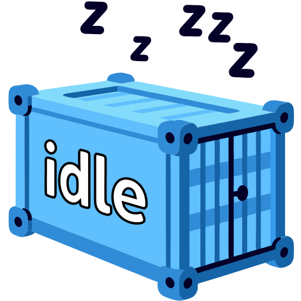

<h1 align="center">idle: The Chillest Container You'll Ever Run 💤</h1>

<div align="center">
  
</div>

Ever needed a container that does absolutely nothing, but does it really well? Meet **idle**, the ultimate minimalist container designed to idle indefinitely with elegance. Lightweight, multi-arch, low level and optimized, it's like the Zen master of containers - perfect for Kubernetes experiments, testing, or just hanging out in your cluster.

## Features

- **Ultra-Lightweight**: Runs on a `scratch` base, with binaries so small you’ll wonder where they went
- **Purposefully Pointless**: It’s not lazy - it’s just really good at waiting
- **Multi-Arch Zen**: Built for every architecture you can think of (probably)
- **Graceful SIGINT/SIGTERM Handling**: Shuts down cleanly when your cluster tells it to go
- **Prebuilt for the Impatient**: Grab it straight from Docker Hub and let it chill in your cluster

## Prebuilt Images: Ready to Sit and Stay 🐾

Prebuilt images are available on Docker Hub as `spurin/idle`. They support the following architectures, so your cluster nodes can all feel included:

- `linux/arm64`
- `linux/amd64`
- `linux/amd64/v2`
- `linux/riscv64`
- `linux/ppc64le`
- `linux/s390x`
- `linux/386`
- `linux/arm/v6 `
- `linux/arm/v7`

## Run it in Docker

```
docker run --rm spurin/idle:latest
```

## Kubernetes? Why Not?

```
apiVersion: apps/v1
kind: Deployment
metadata:
  name: idle
spec:
  replicas: 3
  selector:
    matchLabels:
      app: idle
  template:
    metadata:
      labels:
        app: idle
    spec:
      containers:
      - name: idle
        image: spurin/idle:latest
```

## How It Works: A Masterclass in Doing Nothing

**idle** is written in minimalist C. It includes graceful handling of SIGINT/SIGTERM signals for a clean shutdown, ensuring it's a well-behaved citizen in your Kubernetes cluster. The multi-stage Dockerfile:

1. Compiles C code with gcc and musl to remove unnecessary components
2. Statically links the code into a self-contained binary
3. Packs it into a scratch container for maximum minimalism

The program itself:

- Loops indefinitely with a 1-second nanosleep
- Listens for SIGINT/SIGTERM signals to gracefully exit when asked

## Why Use idle?

- **For Testing and Debugging**: Need a placeholder container for your cluster? **idle**’s got your back
- **Learn and Tinker**: Dive into multi-arch builds, assembly, and minimalist container design
- **Extreme Minimalism**: Impress your friends with a container that weighs less than your config files
- **Learning Multi-Stage Builds**: Demonstrates a clean, efficient container workflow
- **Cluster Ready**: Give your Kubernetes cluster something to meditate on

## Why Not Just Use the Pause Container?

The pause container is like Kubernetes' overachiever - handling process reaping, PID 1 compliance, and namespace integration. Great for Kubernetes internals, but do you really need all that when you're just testing?  

**idle** takes a simpler approach: 

- **Bare minimum**: Uses `nanosleep`, skips `main()`, and avoids runtime dependencies. No glibc, no base OS, just `_start` and chill.  
- **Smaller size**: Aggressively stripped, statically compiled, and leaner than *registry.k8s.io/pause:3.9*. Compare the two on [oci.dag.dev](https://oci.dag.dev), choosing a common arch like *arm64* - the difference speaks for itself.  

*TL;DR*: **idle** does less, is smaller, and stays true to its name. Why overthink when you can over-idle?  

## About the Zen of idle 🧘

**idle** isn’t just a container - it’s a philosophy. Sometimes, the best action is no action at all. Whether you’re testing workloads, experimenting with cluster scaling, or just need a pod to sit there and look pretty, **idle** is here to remind you: less is more.

## License

This project is released into the public domain. You are free to use, modify, distribute, or do whatever you want with it, without restriction or attribution.

For more details, see http://unlicense.org

## Thanks! 🙏

[@SylvanFranklin](https://github.com/SylvanFranklin) [@nescohen](https://github.com/nescohen)
